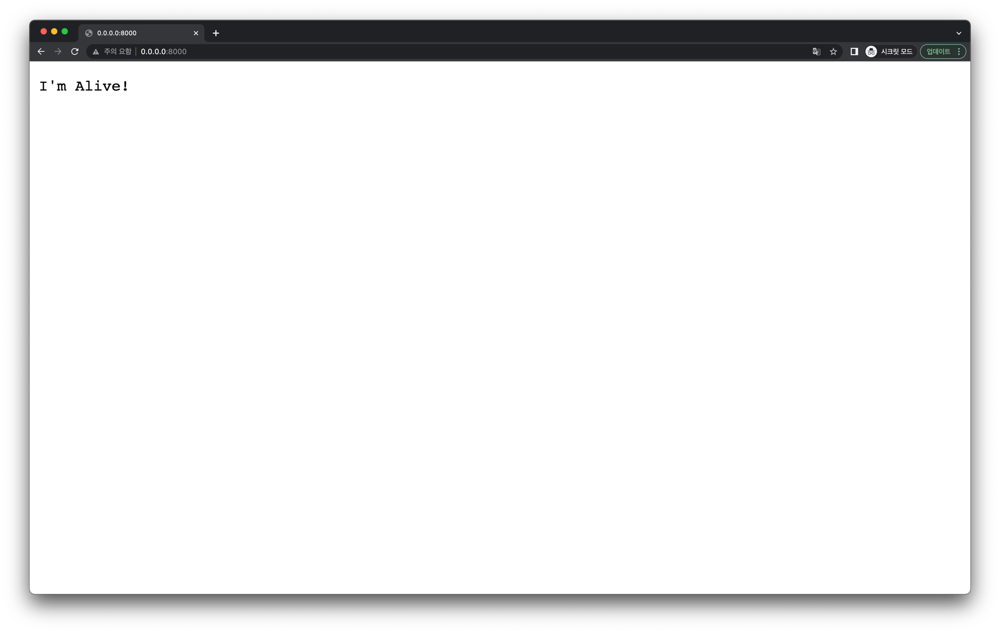
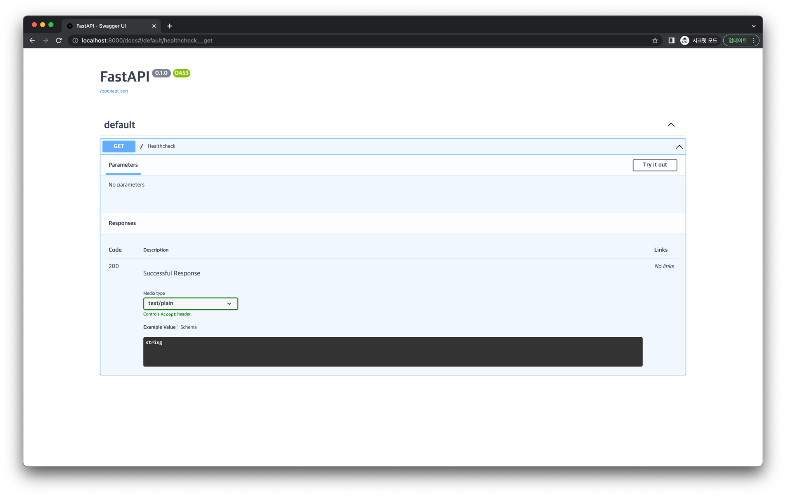

# 간단한 API 엔드포인트 만들고 확인하기

먼저 헬스체크용 API 엔드포인트를 만들어봅시다.

## 엔드포인트 추가

다음처럼 엔드포인트를 추가하는 코드를 `app.py`에 작성합니다.

```python
from fastapi import status
from fastapi.responses import PlainTextResponse

@app.get("/", response_class=PlainTextResponse, status_code=status.HTTP_200_OK)
def healthcheck() -> str:
    return "I'm Alive!"
```

- 이는 `/` 엔드포인트로 `GET` 요청이 왔을 때 `"I'm Alive"` 라는 텍스트와 `200` Status Code를 내보내도록 작성한 것입니다.
- FastAPI 에서는 기본적으로 위와 같은 방식으로 엔드포인트 로직을 서버에 추가할 수 있습니다.

## 정리

지금까지 `app.py` 에 작성한 코드는 다음과 같습니다. (하이라이팅된 부분은 이번 내용을 통해 추가된 부분입니다.)

```python{42-47}
# app.py

import time
from typing import Optional

from sqlmodel import Field, SQLModel, create_engine

class Post(SQLModel, table=True):
    id: Optional[int] = Field(default=None, primary_key=True)
    title: str
    author: str
    content: str
    created_at: Optional[int] = Field(default_factory=time.time)
    updated_at: Optional[int] = Field(default_factory=time.time)

sqlite_file_name = "database.db"
sqlite_url = f"sqlite:///{sqlite_file_name}"

engine = create_engine(sqlite_url, echo=True)


def create_db_and_tables() -> None:
    SQLModel.metadata.create_all(engine)

from fastapi import FastAPI    

app = FastAPI()

import uvicorn

@app.on_event("startup")
def handle_startup_event():
    create_db_and_tables()

def main() -> None:
    uvicorn.run(app, host="0.0.0.0", port=8000)


if __name__ == "__main__":
    main()
    
from fastapi import status
from fastapi.responses import PlainTextResponse

@app.get("/", response_class=PlainTextResponse, status_code=status.HTTP_200_OK)
def healthcheck() -> str:
    return "I'm Alive!"
```

## 동작 확인

이제 브라우저에서 `http://0.0.0.0:8000/` 으로 접속해봅시다.
그러면 다음처럼 `"I'm Alive"` 텍스트가 등장하는 것을 확인할 수 있습니다.



또한 `http://0.0.0.0:8000/docs` 에서 Swagger로 작성된 API 문서를 확인할 수 있습니다.


