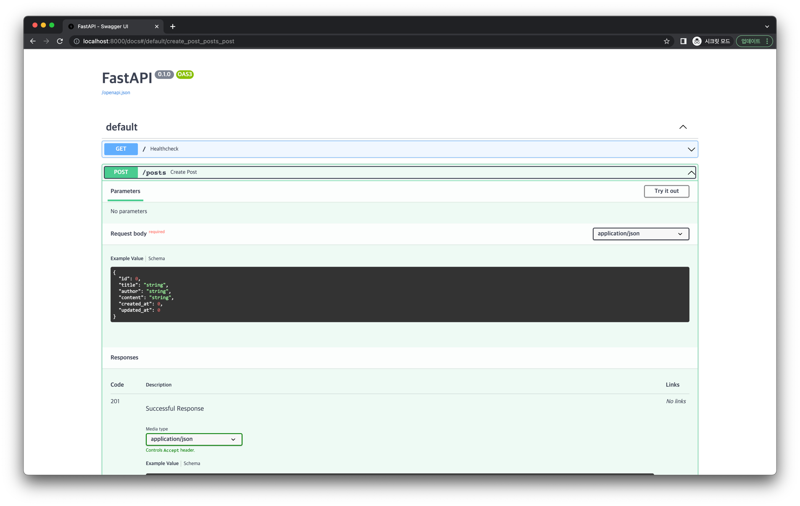
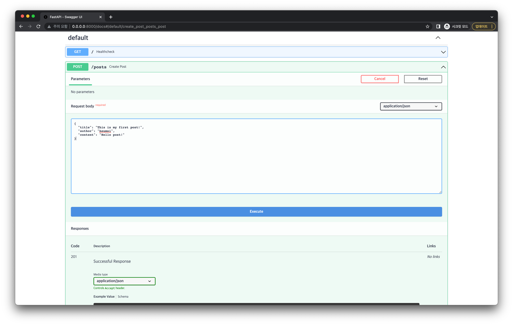
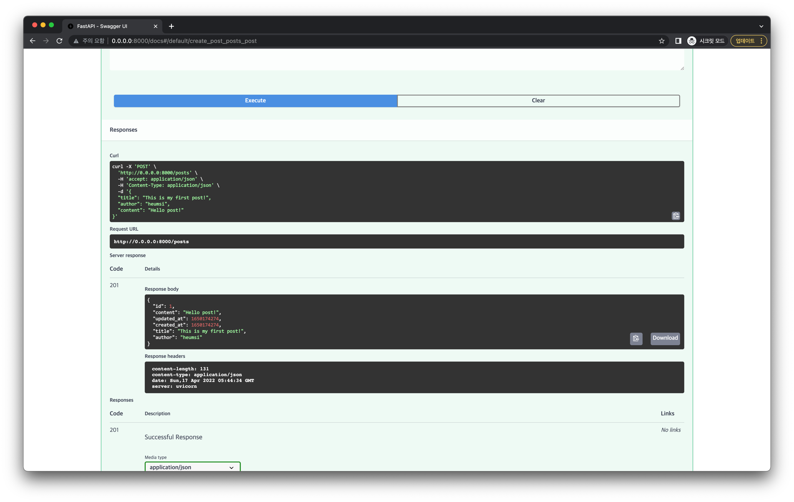

# 게시글 생성
 
이번엔 게시글을 생성하는 API 엔드포인트를 만들어봅시다.

## 엔드포인트 추가

다음 코드를 `app.py`에 추가합니다.

```python
from sqlmodel import Session

@app.post("/posts", status_code=status.HTTP_201_CREATED)
def create_post(new_post: Post) -> Post:
    with Session(engine) as session:
        session.add(new_post)
        session.commit()
        session.refresh(new_post)
        return new_post
```

크게 두 부분으로 나누어 자세히 살펴보겠습니다.

```python{3-4}
from sqlmodel import Session

@app.post("/posts", status_code=status.HTTP_201_CREATED)
def create_post(new_post: Post) -> Post:
    with Session(engine) as session:
        session.add(new_post)
        session.commit()
        session.refresh(new_post)
        return new_post
```

- `/posts` 엔드포인트로 `POST` 요청이 왔을 때, `201` Status Code를 내보냅니다.
- `create_post()` 함수의 `new_post` 파라미터는 엔드 포인트 요청에 담긴 JSON Payload 입니다.
  - 타입이 `Post` 로 정의되어 있으므로, JSON Payload의 스키마는 `Post` 모델 형태여야 합니다.
  - JSON 포맷으로 넘어온 데이터는 FastAPI에 의해 자동으로 `Post` 인스턴스로 변환됩니다.
  - 즉 최종적으로 `new_post` 에는 `Post` 인스턴스가 담기게 됩니다.

```python{5-9}
from sqlmodel import Session

@app.post("/posts", status_code=status.HTTP_201_CREATED)
def create_post(new_post: Post) -> Post:
    with Session(engine) as session:
        session.add(new_post)
        session.commit()
        session.refresh(new_post)
        return new_post
```

- `5` 번 라인을 통해 Database와 연결할 `Session` 객체를 `session` 변수에 담습니다.
  - Database와의 통신은 이 `session` 변수를 통해 진행합니다.
- `6-7` 번 라인을 통해 `new_post` 인스턴스를 Database에 INSERT 하고 커밋합니다.
- `8` 번 라인을 통해 INSERT 한 뒤의 `new_post` 객체를 갱신합니다.
  - 이 때 내부적으로 Database에 `SELECT` 문이 실행되며, INSERT 이후 Database에 저장된 `new_post` 의 정보를 가져옵니다. 
  - 특히 `Post.id` 같은 경우 Database에서 정하게 되는데, 이 값이 이 때 채워지게 됩니다.
- `9` 번 라인을 통해 `new_post` 인스턴스를 반환하며, 이는 최종적으로 응답의 JSON Payload로 담기게 됩니다.

## 정리

지금까지 `app.py` 에 작성한 코드는 다음과 같습니다. (하이라이팅된 부분은 이번 내용을 통해 추가된 부분입니다.)

```python{49-57}
# app.py

import time
from typing import Optional

from sqlmodel import Field, SQLModel, create_engine

class Post(SQLModel, table=True):
    id: Optional[int] = Field(default=None, primary_key=True)
    title: str
    author: str
    content: str
    created_at: Optional[int] = Field(default_factory=time.time)
    updated_at: Optional[int] = Field(default_factory=time.time)

sqlite_file_name = "database.db"
sqlite_url = f"sqlite:///{sqlite_file_name}"

engine = create_engine(sqlite_url, echo=True)


def create_db_and_tables() -> None:
    SQLModel.metadata.create_all(engine)

from fastapi import FastAPI    

app = FastAPI()

import uvicorn

@app.on_event("startup")
def handle_startup_event():
    create_db_and_tables()

def main() -> None:
    uvicorn.run(app, host="0.0.0.0", port=8000)


if __name__ == "__main__":
    main()
    
from fastapi import status
from fastapi.responses import PlainTextResponse

@app.get("/", response_class=PlainTextResponse, status_code=status.HTTP_200_OK)
def healthcheck() -> str:
    return "I'm Alive!"
    
from sqlmodel import Session

@app.post("/posts", status_code=status.HTTP_201_CREATED)
def create_post(new_post: Post) -> Post:
    with Session(engine) as session:
        session.add(new_post)
        session.commit()
        session.refresh(new_post)
        return new_post
```

## 동작 확인

서버를 재실행한 뒤, 브라우저에서 `http://0.0.0.0:8000/docs` 에 접속해봅시다.

:::tip
아래 방식으로 서버를 실행했다면, 자동으로 재실행되기 때문에 서버를 껐다가 다시 키지 않아도 됩니다.

```bash
uvicorn app:app --host "0.0.0.0" --port 8000 --reload
```
:::

다음처럼 게시글 생성 API 엔드포인트가 추가된 것을 확인할 수 있습니다.



정말 잘 작동하는지 요청을 한번 날려봅시다.

Try it out 버튼을 누른 뒤 Request body를 다음처럼 채웁니다.
(`id`, `created_at`, `updated_at` 은 굳이 입력하지 않아도 서버에서 기본 값으로 채우므로 입력하지 않습니다.)

```json
{
  "title": "This is my first post!",
  "author": "heumsi",
  "content": "Hello post!"
}
```



이제 Execute 버튼을 누르면 다음처럼 요청이 가고, 아래 Responses 부분에 응답 값에 대해 확인할 수 있습니다.



`201` Status Code로 응답이 잘 왔고, Response Body에도 의도한 대로 Json 데이터가 잘 나와있습니다.
