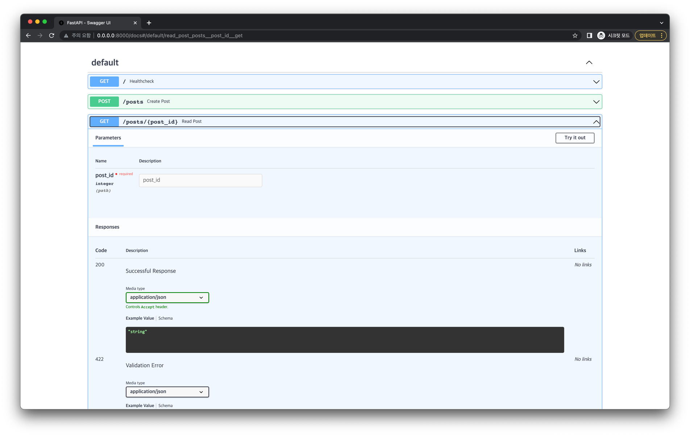
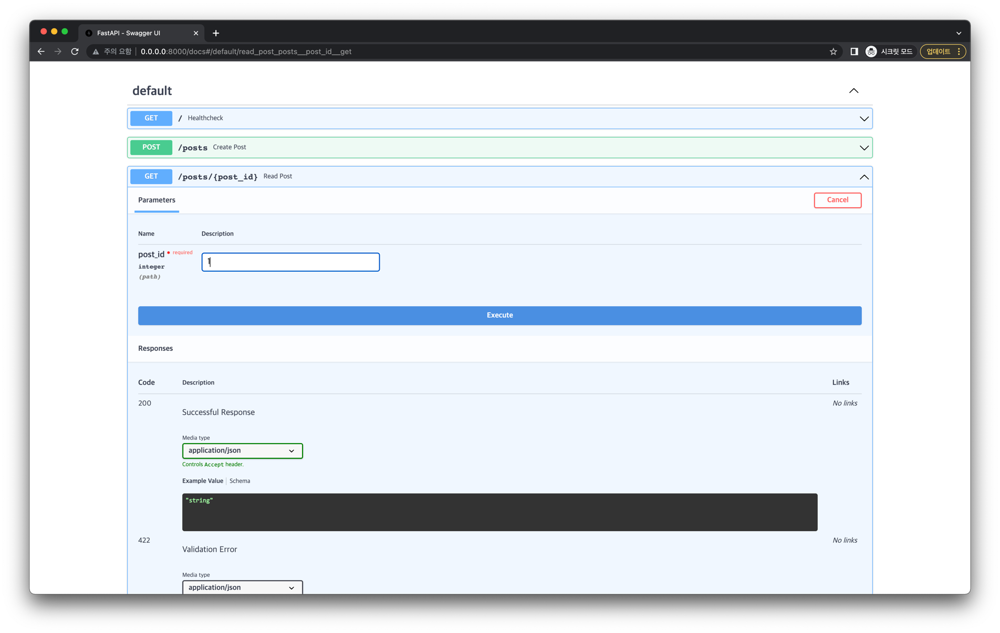
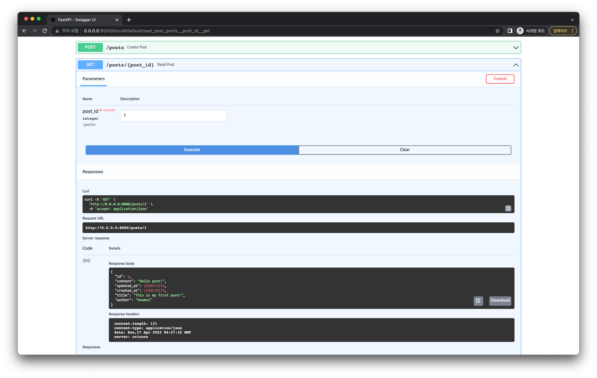

# 게시글 조회
 
이번엔 특정 게시글을 조회하는 API 엔드포인트를 만들어봅시다.

## 엔드포인트 추가

다음 코드를 `app.py`에 추가합니다.

```python
from fastapi import HTTPException

@app.get("/posts/{post_id}", status_code=status.HTTP_200_OK)
def read_post(post_id: int) -> Post:
    with Session(engine) as session:
        post = session.get(Post, post_id)
        if not post:
            raise HTTPException(status_code=404, detail="Post not found")
        return post
```

- `/posts/{post_id}` 엔드포인트로 `GET` 요청이 왔을 때, `200` Status Code를 내보냅니다.
- `post_id` 라는 Path Parameter를 통해 조회할 게시글의 id를 입력받습니다.
  - 예를 들면 `/posts/1` 와 같이 URL로 전달합니다.
- 이전과 마찬가지로 Database와 연결할 `Session` 객체를 얻어, Database에서 `post_id`에 해당하는 Post 데이터를 받아옵니다.
- 존재하지 않을 경우 `404` Http Error 를 뱉도록 합니다.
- 존재할 경우 Post 데이터를 JSON Payload로 내보냅니다.

## 정리

지금까지 `app.py` 에 작성한 코드는 다음과 같습니다. (하이라이팅된 부분은 이번 내용을 통해 추가된 부분입니다.)

```python{59-67}
# app.py

import time
from typing import Optional

from sqlmodel import Field, SQLModel, create_engine

class Post(SQLModel, table=True):
    id: Optional[int] = Field(default=None, primary_key=True)
    title: str
    author: str
    content: str
    created_at: Optional[int] = Field(default_factory=time.time)
    updated_at: Optional[int] = Field(default_factory=time.time)

sqlite_file_name = "database.db"
sqlite_url = f"sqlite:///{sqlite_file_name}"

engine = create_engine(sqlite_url, echo=True)


def create_db_and_tables() -> None:
    SQLModel.metadata.create_all(engine)

from fastapi import FastAPI    

app = FastAPI()

import uvicorn

@app.on_event("startup")
def handle_startup_event():
    create_db_and_tables()

def main() -> None:
    uvicorn.run(app, host="0.0.0.0", port=8000)


if __name__ == "__main__":
    main()
    
from fastapi import status
from fastapi.responses import PlainTextResponse

@app.get("/", response_class=PlainTextResponse, status_code=status.HTTP_200_OK)
def healthcheck() -> str:
    return "I'm Alive!"
    
from sqlmodel import Session

@app.post("/posts", status_code=status.HTTP_201_CREATED)
def create_post(new_post: Post) -> Post:
    with Session(engine) as session:
        session.add(new_post)
        session.commit()
        session.refresh(new_post)
        return new_post
        
from fastapi import HTTPException

@app.get("/posts/{post_id}", status_code=status.HTTP_200_OK)
def read_post(post_id: int) -> Post:
    with Session(engine) as session:
        post = session.get(Post, post_id)
        if not post:
            raise HTTPException(status_code=404, detail="Post not found")
        return post
```

## 동작 확인

서버를 재실행한 뒤, 브라우저에서 `http://0.0.0.0:8000/docs` 에 접속해봅시다.

:::tip
아래 방식으로 서버를 실행했다면, 자동으로 재실행되기 때문에 서버를 껐다가 다시 키지 않아도 됩니다.

```bash
uvicorn app:app --host "0.0.0.0" --port 8000 --reload
```
:::

다음처럼 게시글 조회 API 엔드포인트가 추가된 것을 확인할 수 있습니다.



정말 잘 작동하는지 요청을 한번 날려봅시다.

Try it out 버튼을 누른 뒤 Parameters에 있는 `post_id` 의 값을 `1`로 입력합니다.
(이 `1`은 우리가 이전에 게시글 생성 - 동작 확인 부분을 통해 만들었던 게시글의 id 입니다.)



이제 Execute 버튼을 누르면 다음처럼 요청이 가고, 아래 Responses 부분에 응답 값에 대해 확인할 수 있습니다.



`200` Status Code로 응답이 잘 왔고, Response Body에도 의도한 대로 Json 데이터가 잘 나와있습니다.
