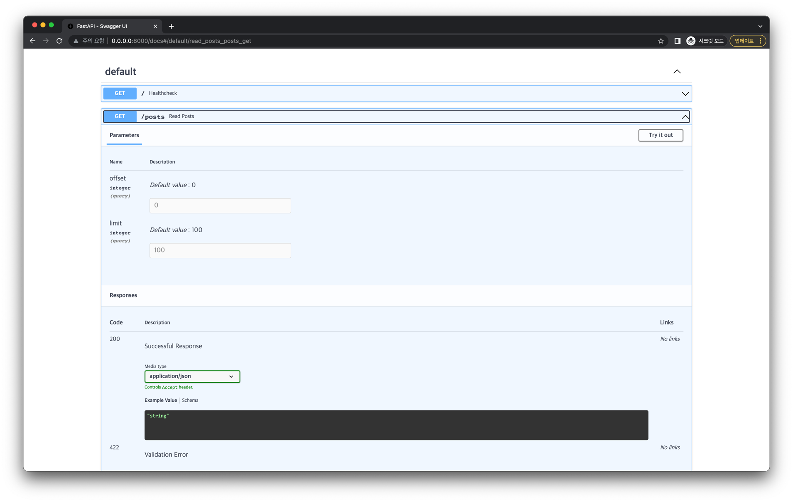
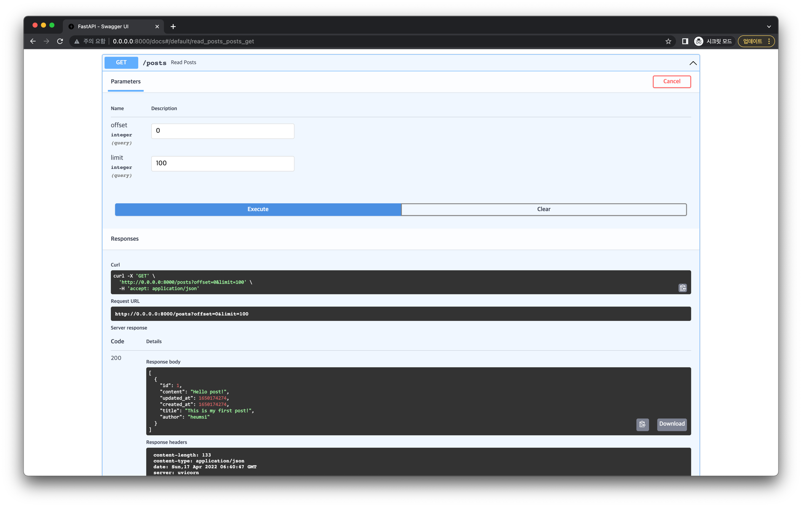

# 게시글 목록 조회

이번에는 전체 게시글 목록을 조회하는 엔드포인트를 만들어 봅시다.
 
## 엔드포인트 추가

다음 코드를 `app.py`에 추가합니다.

```python
from typing import List

from fastapi import Query
from sqlmodel import select

@app.get("/posts", status_code=status.HTTP_200_OK)
def read_posts(offset: int = 0, limit: int = Query(default=100, lte=100)) -> List[Post]:
    with Session(engine) as session:
        statement = select(Post).offset(offset).limit(limit)
        results = session.exec(statement)
        posts = results.all()
        return posts
```

- `/posts/` 엔드포인트로 `GET` 요청이 왔을 때, `200` Status Code를 내보냅니다.
- `offset`, `limit` 는 Query Parameter 입니다.
  - 예를 들면 `/posts?offset=0&limit=100` 과 같이 URL로 전달됩니다.
  - `offset` 의 기본 값은 0 이며, 요청에 별도로 값을 지정해주지 않으면 이 값을 쓰게 됩니다.
  - `limit`의 기본 값은 100이며, 마찬가지로 요청에 별도로 값을 지정해주지 않으면 이 값을 쓰게 됩니다.
    - `limit` 값을 지정해주는 경우, 이 값은 100보다 작야아합니다. 만약 100 이상일 시 요청 에러를 반환하게 됩니다.
- 이전과 마찬가지로 Database와 연결할 `Session` 객체를 얻어, Database에서 Post 데이터를 받아옵니다.
  - 이 때 `.offset()` 과 `.limit()` 함수로 모든 데이터를 받아오지 않고 특정 데이터만 받아오도록 합니다.
  - 이렇게 하는 이유는, Post 데이터가 매우 많은 경우 한번에 모든 데이터를 받아오면 부하가 매우 클 수 있기 때문입니다.
  - 따라서 전체가 아닌 적당한 단위로 데이터를 들고와야 하는데, 이 때 offset, limit이 사용됩니다. (이를 페이지네이션 기법이라 합니다.)
- `9` 번 라인을 통해 Database에서 실행할 Statement 문을 완성합니다.
- `10`번 라인을 통해 작성한 Statement 문을 실행하고 결과를 받습니다.
- `11`번 라인을 통해 결과에서 실제 데이터들을 fetch해 옵니다.
- 최종적으로 `List[Post]` 형태의 데이터들을 JSON Payload로 내보냅니다.

## 정리

지금까지 `app.py` 에 작성한 코드는 다음과 같습니다. (하이라이팅된 부분은 이번 내용을 통해 추가된 부분입니다.)

```python{69-80}
# app.py

import time
from typing import Optional

from sqlmodel import Field, SQLModel, create_engine

class Post(SQLModel, table=True):
    id: Optional[int] = Field(default=None, primary_key=True)
    title: str
    author: str
    content: str
    created_at: Optional[int] = Field(default_factory=time.time)
    updated_at: Optional[int] = Field(default_factory=time.time)

sqlite_file_name = "database.db"
sqlite_url = f"sqlite:///{sqlite_file_name}"

engine = create_engine(sqlite_url, echo=True)


def create_db_and_tables() -> None:
    SQLModel.metadata.create_all(engine)

from fastapi import FastAPI    

app = FastAPI()

import uvicorn

@app.on_event("startup")
def handle_startup_event():
    create_db_and_tables()

def main() -> None:
    uvicorn.run(app, host="0.0.0.0", port=8000)


if __name__ == "__main__":
    main()
    
from fastapi import status
from fastapi.responses import PlainTextResponse

@app.get("/", response_class=PlainTextResponse, status_code=status.HTTP_200_OK)
def healthcheck() -> str:
    return "I'm Alive!"
    
from sqlmodel import Session

@app.post("/posts", status_code=status.HTTP_201_CREATED)
def create_post(new_post: Post) -> Post:
    with Session(engine) as session:
        session.add(new_post)
        session.commit()
        session.refresh(new_post)
        return new_post
        
from fastapi import HTTPException

@app.get("/posts/{post_id}", status_code=status.HTTP_200_OK)
def read_post(post_id: int) -> Post:
    with Session(engine) as session:
        post = session.get(Post, post_id)
        if not post:
            raise HTTPException(status_code=404, detail="Post not found")
        return post

from typing import List

from fastapi import Query
from sqlmodel import select

@app.get("/posts", status_code=status.HTTP_200_OK)
def read_posts(offset: int = 0, limit: int = Query(default=100, lte=100)) -> List[Post]:
    with Session(engine) as session:
        statement = select(Post).offset(offset).limit(limit)
        results = session.exec(statement)
        posts = results.all()
        return posts
```

## 동작 확인

서버를 재실행한 뒤, 브라우저에서 `http://0.0.0.0:8000/docs` 에 접속해봅시다.

:::tip
아래 방식으로 서버를 실행했다면, 자동으로 재실행되기 때문에 서버를 껐다가 다시 키지 않아도 됩니다.

```bash
uvicorn app:app --host "0.0.0.0" --port 8000 --reload
```
:::

다음처럼 게시글 목록 조회 API 엔드포인트가 추가된 것을 확인할 수 있습니다.



정말 잘 작동하는지 요청을 한번 날려봅시다.

Try it out 버튼을 누른 뒤 Execute 버튼을 눌러 실행합니다.



`200` Status Code로 응답이 잘 왔고, Response Body에도 의도한 대로 Json 데이터가 잘 나와있습니다.
