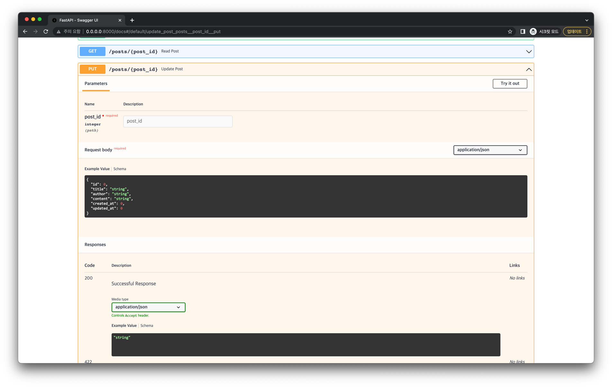
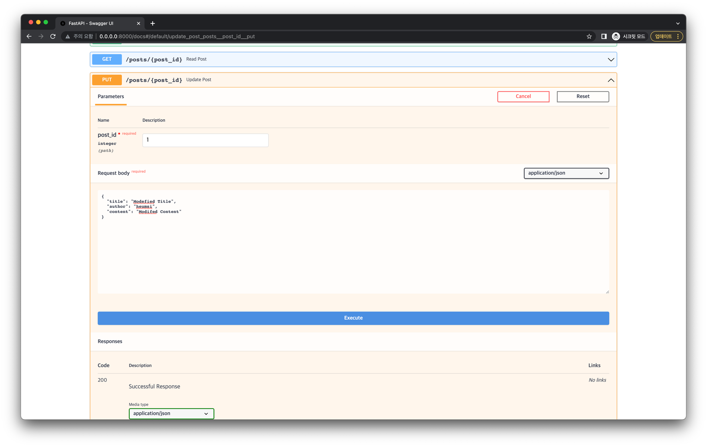
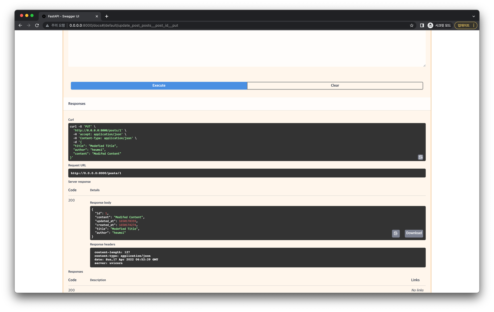

# 게시글 수정

이번에는 게시글을 수정하는 엔드포인트를 만들어 봅시다.
 
## 엔드포인트 추가

다음 코드를 `app.py`에 추가합니다.

```python
@app.put("/posts/{post_id}", status_code=status.HTTP_200_OK)
def update_post(post_id: int, updated_post: Post) -> Post:
    with Session(engine) as session:
        post = session.get(Post, post_id)
        if not post:
            raise HTTPException(status_code=404, detail="Post not found")
        post.updated_at = int(time.time())
        updated_post_data = updated_post.dict(exclude_unset=True)
        for key, value in updated_post_data.items():
            setattr(post, key, value)
        session.add(post)
        session.commit()
        session.refresh(post)
        return post
```

- `/posts/{post_id}` 엔드포인트로 `PUT` 요청이 왔을 때, `200` Status Code를 내보냅니다.
- `post_id` 라는 Path Parameter도 존재하고, `updated_post` 라는 JSON Payload도 존재합니다. 
- 이전과 마찬가지로 Database와 연결할 `Session` 객체를 얻어, Database에서 `id`가 post_id` 에 해당하는 Post 데이터를 받아옵니다.
- 해당하는 Post 데이터가 존재하지 않으면 404 에러를 내보냅니다.
- 해당하는 Post 데이터가 존재하는 경우, 해당 Post 데이터의 속성 값들을 `updated_post` 의 속성 값들로 수정합니다.
- 커밋을 통해 Database에 반영한 뒤, 리프레시를 통해 업데이트 된 값으로 다시 `post` 인스턴스를 갱신합니다.
- 최종적으로 갱신된 `post` 객체를 JSON payload로 내보냅니다.

## 정리

지금까지 `app.py` 에 작성한 코드는 다음과 같습니다. (하이라이팅된 부분은 이번 내용을 통해 추가된 부분입니다.)

```python{82-95}
# app.py

import time
from typing import Optional

from sqlmodel import Field, SQLModel, create_engine

class Post(SQLModel, table=True):
    id: Optional[int] = Field(default=None, primary_key=True)
    title: str
    author: str
    content: str
    created_at: Optional[int] = Field(default_factory=time.time)
    updated_at: Optional[int] = Field(default_factory=time.time)

sqlite_file_name = "database.db"
sqlite_url = f"sqlite:///{sqlite_file_name}"

engine = create_engine(sqlite_url, echo=True)


def create_db_and_tables() -> None:
    SQLModel.metadata.create_all(engine)

from fastapi import FastAPI    

app = FastAPI()

import uvicorn

@app.on_event("startup")
def handle_startup_event():
    create_db_and_tables()

def main() -> None:
    uvicorn.run(app, host="0.0.0.0", port=8000)


if __name__ == "__main__":
    main()
    
from fastapi import status
from fastapi.responses import PlainTextResponse

@app.get("/", response_class=PlainTextResponse, status_code=status.HTTP_200_OK)
def healthcheck() -> str:
    return "I'm Alive!"
    
from sqlmodel import Session

@app.post("/posts", status_code=status.HTTP_201_CREATED)
def create_post(new_post: Post) -> Post:
    with Session(engine) as session:
        session.add(new_post)
        session.commit()
        session.refresh(new_post)
        return new_post
        
from fastapi import HTTPException

@app.get("/posts/{post_id}", status_code=status.HTTP_200_OK)
def read_post(post_id: int) -> Post:
    with Session(engine) as session:
        post = session.get(Post, post_id)
        if not post:
            raise HTTPException(status_code=404, detail="Post not found")
        return post

from typing import List

from fastapi import Query
from sqlmodel import select

@app.get("/posts", status_code=status.HTTP_200_OK)
def read_posts(offset: int = 0, limit: int = Query(default=100, lte=100)) -> List[Post]:
    with Session(engine) as session:
        statement = select(Post).offset(offset).limit(limit)
        results = session.exec(statement)
        posts = results.all()
        return posts
        
@app.put("/posts/{post_id}", status_code=status.HTTP_200_OK)
def update_post(post_id: int, updated_post: Post) -> Post:
    with Session(engine) as session:
        post = session.get(Post, post_id)
        if not post:
            raise HTTPException(status_code=404, detail="Post not found")
        post.updated_at = int(time.time())
        updated_post_data = updated_post.dict(exclude_unset=True)
        for key, value in updated_post_data.items():
            setattr(post, key, value)
        session.add(post)
        session.commit()
        session.refresh(post)
        return post
```

## 동작 확인

서버를 재실행한 뒤, 브라우저에서 `http://0.0.0.0:8000/docs` 에 접속해봅시다.

:::tip
아래 방식으로 서버를 실행했다면, 자동으로 재실행되기 때문에 서버를 껐다가 다시 키지 않아도 됩니다.

```bash
uvicorn app:app --host "0.0.0.0" --port 8000 --reload
```
:::

다음처럼 게시글 수정 API 엔드포인트가 추가된 것을 확인할 수 있습니다.



정말 잘 작동하는지 요청을 한번 날려봅시다.

Try it out 버튼을 누른 뒤 `post_id` 값은 `1`로, Request Body는 다음처럼 입력합니다.
(이 `1`은 우리가 이전에 게시글 생성 - 동작 확인 부분을 통해 만들었던 게시글의 id 입니다.)

```json
{
  "title": "Modefied Title",
  "author": "heumsi",
  "content": "Modifed Content"
}
```



Execute 버튼을 눌러 실행합니다.



`200` Status Code로 응답이 잘 왔고, Response Body에도 의도한 대로 수정된 데이터를 표현하는 Json 데이터가 잘 나와있습니다.
