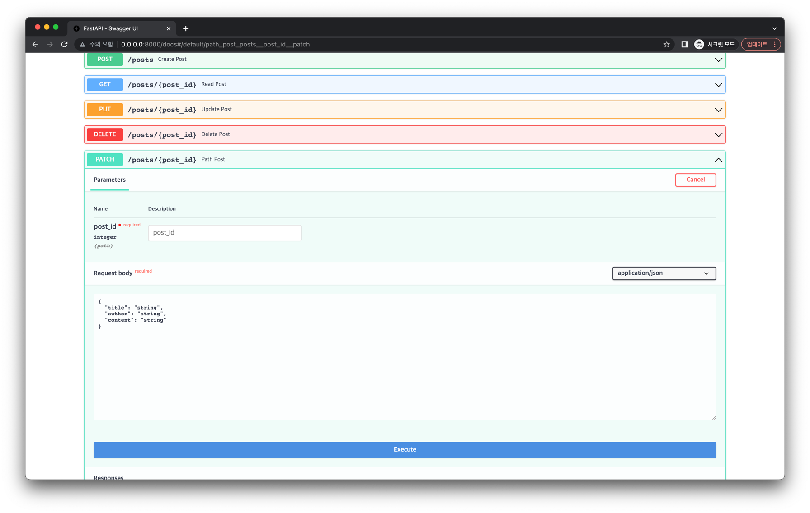

# PATCH 엔드포인트 구현하기

이번에는 데이터 모델의 일부만 수정할 수 있는 PATCH 요청을 처리하는 엔드포인트를 구현해봅시다.

## 모델 추가하기

먼저 `main.py` 에 다음처럼 PATCH 요청 모델을 추가합니다.

```python{23-26}
import time
from typing import Optional

from sqlmodel import SQLModel, Field


def get_current_unix_timestamp() -> int:
    return int(time.time())


class PostBase(SQLModel):
    title: str
    author: str
    content: str


class Post(PostBase, table=True):
    id: Optional[int] = Field(default=None, primary_key=True)
    created_at: Optional[int] = Field(default_factory=get_current_unix_timestamp)
    updated_at: Optional[int] = Field(default_factory=get_current_unix_timestamp)


class PostPatch(PostBase):
    title: Optional[str]
    author: Optional[str]
    content: Optional[str]
```

## 엔드포인트 핸들러 작성하기

`api.py`에 다음처럼 엔드포인트를 추가합니다.

```python{5,60-73}
from sqlmodel import Session, select

from src.database import engine, create_db_and_tables
from src.model import Post
from src.model import Post, PostPatch
from src.model import PostBase, get_current_unix_timestamp

app = FastAPI()


@app.get("/", response_class=PlainTextResponse, status_code=status.HTTP_200_OK)
def healthcheck() -> str:
    return "I'm Alive!"


@app.post("/posts", status_code=status.HTTP_201_CREATED)
def create_post(post_base: PostBase) -> Post:
    with Session(engine) as session:
        new_post = Post.from_orm(post_base)
        session.add(new_post)
        session.commit()
        session.refresh(new_post)
        return new_post


@app.get("/posts/{post_id}", status_code=status.HTTP_200_OK)
def read_post(post_id: int) -> Post:
    with Session(engine) as session:
        post = session.get(Post, post_id)
        if not post:
            raise HTTPException(status_code=404, detail="Post not found")
        return post


@app.get("/posts", status_code=status.HTTP_200_OK)
def read_posts(offset: int = 0, limit: int = Query(default=100, lte=100)) -> List[Post]:
    with Session(engine) as session:
        statement = select(Post).offset(offset).limit(limit)
        results = session.exec(statement)
        posts = results.all()
        return posts


@app.put("/posts/{post_id}", status_code=status.HTTP_200_OK)
def update_post(post_id: int, post_base: PostBase) -> Post:
    with Session(engine) as session:
        post = session.get(Post, post_id)
        if not post:
            raise HTTPException(status_code=404, detail="Post not found")
        post.updated_at = get_current_unix_timestamp()
        updated_post_data = post_base.dict(exclude_unset=True)
        for key, value in updated_post_data.items():
            setattr(post, key, value)
        session.add(post)
        session.commit()
        session.refresh(post)
        return post


@app.patch("/posts/{post_id}", status_code=status.HTTP_200_OK)
def patch_post(post_id: int, post_patch: PostPatch) -> Post:
    with Session(engine) as session:
        post = session.get(Post, post_id)
        if not post:
            raise HTTPException(status_code=404, detail="Post not found")
        post.updated_at = get_current_unix_timestamp()
        updated_post_data = post_patch.dict(exclude_unset=True)
        for key, value in updated_post_data.items():
            setattr(post, key, value)
        session.add(post)
        session.commit()
        session.refresh(post)
        return post


@app.delete("/posts/{post_id}", status_code=status.HTTP_204_NO_CONTENT)
def delete_post(post_id: int) -> None:
    with Session(engine) as session:
```

## API 문서에서 확인하기

다음처럼 서버를 기동한 뒤 API 문서에서 PATCH 엔드포인트가 잘 동작하는지 확인해봅시다.

```bash
$ python src/main.py
```



PATCH 엔드포인트가 잘 동작하는 것을 확인했습니다!
