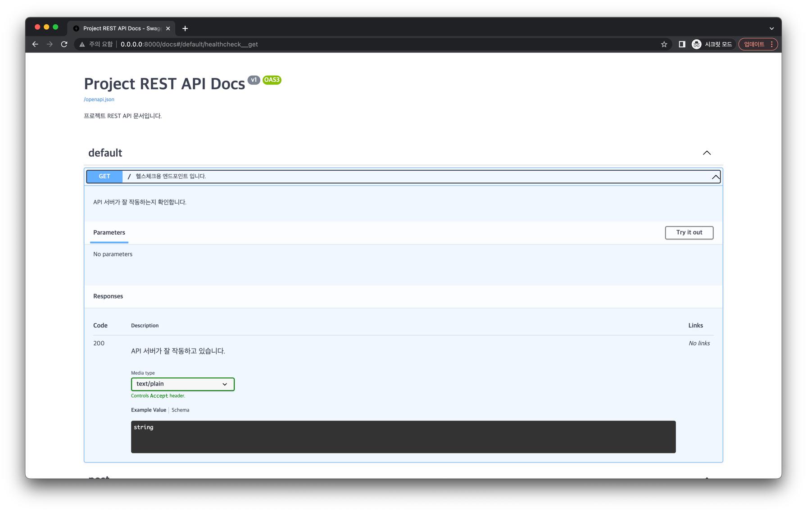

# API 메타 데이터 풍성하기 하기

이번에는 모델이 아니라 API에도 메타 데이터가 풍성하게 만들어봅시다.

`api.py` 를 다음처럼 수정합니다.

```python{11-15,18-24,29,32,42,51,60,76,92}
from typing import List

from fastapi import FastAPI, HTTPException, status, Query
from fastapi.responses import PlainTextResponse
from sqlmodel import Session, select

from src.database import engine, create_db_and_tables
from src.model import Post, PostPatch
from src.model import PostBase, get_current_unix_timestamp

app = FastAPI(
    title="Project REST API Docs",
    description="프로젝트 REST API 문서입니다.",
    version="v1",
)


@app.get("/",
    response_class=PlainTextResponse,
    status_code=status.HTTP_200_OK,
    summary="헬스체크용 엔드포인트 입니다.",
    description="API 서버가 잘 작동하는지 확인합니다.",
    response_description="API 서버가 잘 작동하고 있습니다.",
)
def healthcheck() -> str:
    return "I'm Alive!"


tags = ["post"]


@app.post("/posts", status_code=status.HTTP_201_CREATED, tags=tags)
def create_post(post_base: PostBase) -> Post:
    with Session(engine) as session:
        new_post = Post.from_orm(post_base)
        session.add(new_post)
        session.commit()
        session.refresh(new_post)
        return new_post


@app.get("/posts/{post_id}", status_code=status.HTTP_200_OK, tags=tags)
def read_post(post_id: int) -> Post:
    with Session(engine) as session:
        post = session.get(Post, post_id)
        if not post:
            raise HTTPException(status_code=404, detail="Post not found")
        return post


@app.get("/posts", status_code=status.HTTP_200_OK, tags=tags)
def read_posts(offset: int = 0, limit: int = Query(default=100, lte=100)) -> List[Post]:
    with Session(engine) as session:
        statement = select(Post).offset(offset).limit(limit)
        results = session.exec(statement)
        posts = results.all()
        return posts


@app.put("/posts/{post_id}", status_code=status.HTTP_200_OK, tags=tags)
def update_post(post_id: int, post_base: PostBase) -> Post:
    with Session(engine) as session:
        post = session.get(Post, post_id)
        if not post:
            raise HTTPException(status_code=404, detail="Post not found")
        post.updated_at = get_current_unix_timestamp()
        updated_post_data = post_base.dict(exclude_unset=True)
        for key, value in updated_post_data.items():
            setattr(post, key, value)
        session.add(post)
        session.commit()
        session.refresh(post)
        return post


@app.patch("/posts/{post_id}", status_code=status.HTTP_200_OK, tags=tags)
def path_post(post_id: int, post_patch: PostPatch) -> Post:
    with Session(engine) as session:
        post = session.get(Post, post_id)
        if not post:
            raise HTTPException(status_code=404, detail="Post not found")
        post.updated_at = get_current_unix_timestamp()
        updated_post_data = post_patch.dict(exclude_unset=True)
        for key, value in updated_post_data.items():
            setattr(post, key, value)
        session.add(post)
        session.commit()
        session.refresh(post)
        return post


@app.delete("/posts/{post_id}", status_code=status.HTTP_204_NO_CONTENT, tags=tags)
def delete_post(post_id: int) -> None:
    with Session(engine) as session:
        statement = select(Post).where(Post.id == post_id)
        results = session.exec(statement)
        post = results.first()
        if not post:
            raise HTTPException(status_code=404, detail="Post not found")
        session.delete(post)
        session.commit()


@app.on_event("startup")
def handle_startup_event():
    create_db_and_tables()
```

- `FastAPI` 인스턴스를 생성할 때 `title`, `description` 등의 파라미터를 활용할 수 있습니다. 이 값들은 API 문서에 표현됩니다.
- 엔드포인트를 나타내는 데코레이터 `@app.get()` 나 `@app.post()` 에서 `summary`, `description` 등 여러 파라미터를 활용할 수 있습니다. 이 값들은 API 문서에 표현됩니다.

이제 서버 실행 후 API 문서에서 확인해봅시다.

```bash
$ python src/main.py
```



API 문서가 이전보다 더 풍성해졌습니다!
